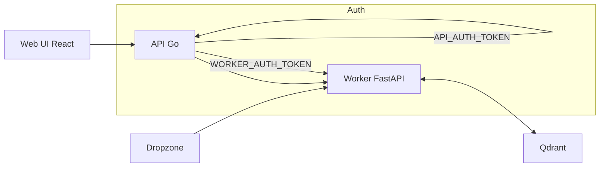

# Architecture

## Overview

jsonify2ai is a local-first document processing and search system with four main components:

1. **Web UI** (React) - User interface for upload, search, and export
2. **API Service** (Go) - Public-facing API with authentication and rate limiting
3. **Worker Service** (FastAPI/Python) - Document parsing, embedding, and vector operations
4. **Qdrant** (Vector DB) - Stores embeddings and metadata

## System Flow

## Components

### Web UI (Port 5173)
- React + Vite
- Auto-detects API URL from hostname
- Uploads files via multipart/form-data
- Real-time status polling
- Export ZIP with manifest.json

### API Service (Port 8082)
- Go + Gin framework
- Handles authentication (`API_AUTH_TOKEN`)
- Rate limiting (upload: 10/min, ask: 30/min)
- Proxies requests to worker service
- CORS configuration for web UI

### Worker Service (Port 8090)
- FastAPI (Python)
- Document parsing (text, PDF, DOCX, CSV, HTML, images, audio)
- Embedding generation (nomic-embed-text, 768-dim)
- Vector upsert to Qdrant
- LLM synthesis (optional Ollama integration)
- Telemetry and logging

### Qdrant (Port 6333)
- Vector database
- Two collections:
  - `jsonify2ai_chunks_768` - Text chunks
  - `jsonify2ai_images_768` - Image embeddings
- Payload indexes on `document_id`, `kind`, `path`

## Data Flow

1. **Upload**: Web UI → API → Worker saves file → Worker parses → Worker embeds → Worker upserts to Qdrant
2. **Search**: Web UI → API → Worker queries Qdrant → Returns top-k results
3. **Ask**: Web UI → API → Worker searches → (Optional) Worker synthesizes with Ollama → Returns answer
4. **Export**: Web UI → API → Worker queries Qdrant by document_id → Returns JSONL or ZIP

## Authentication

- **API_AUTH_TOKEN**: Required for protected API endpoints (upload, search, ask, export)
- **WORKER_AUTH_TOKEN**: Used by API service to authenticate with worker service
- Tokens auto-generated on first run via `scripts/ensure_tokens.{ps1|sh}`

## LLM Integration

When `LLM_PROVIDER=ollama`:
- Worker checks Ollama reachability (memoized 15s cache)
- Status endpoint reports `llm.reachable` boolean
- Ask endpoint synthesizes answers from search results
- UI chip shows status: "on (ollama)", "offline", or "off"

## Development Modes

- `EMBED_DEV_MODE=1`: Skip real embeddings, use dummy vectors
- `AUDIO_DEV_MODE=1`: Skip audio transcription
- `IMAGES_CAPTION=1`: Enable BLIP image captioning

## Deployment

All services run via Docker Compose:
- `docker compose up -d` starts all services
- Services communicate via Docker network
- Qdrant data persisted in `data/qdrant/`
- Worker logs in `data/logs/worker.jsonl`
